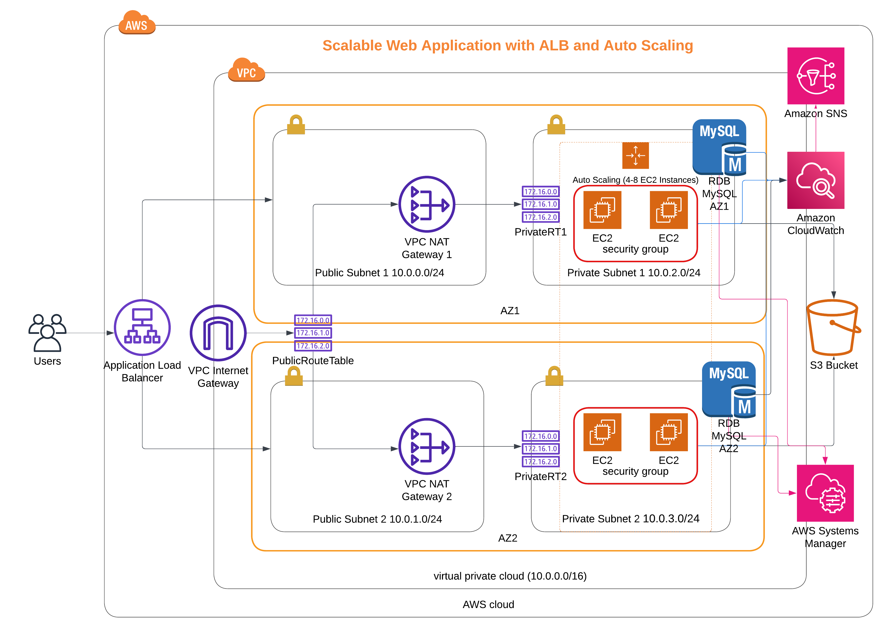
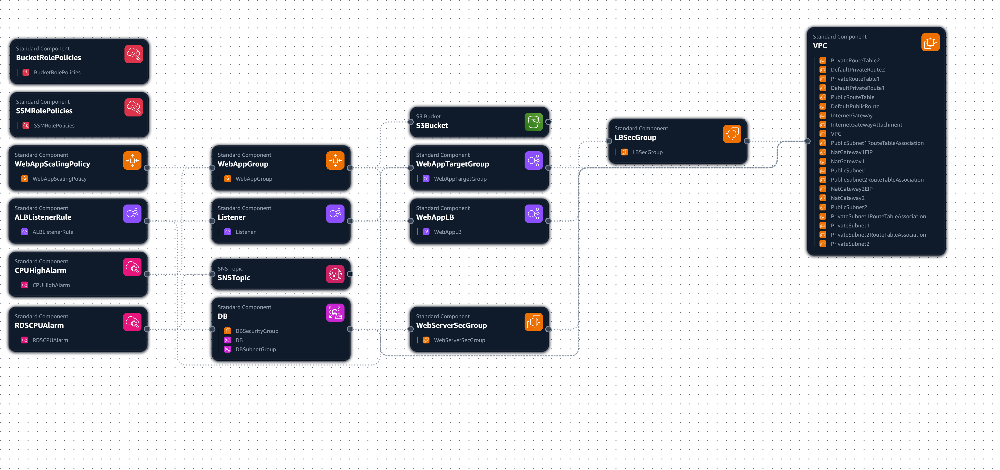

# AWS CloudFormation Infrastructure Documentation

## Table of Contents

1. [Overview](#1-overview)
2. [CloudFormation Template](#2-cloudformation-template)
   - [Structure](#template-structure)
   - [Key Sections](#key-sections)
     - [Networking Components](#21-networking-components)
     - [Compute Resources](#22-compute-resources)
     - [Database Layer](#23-database-layer)
     - [Security Configuration](#24-security-configuration)
     - [Monitoring and Alerting](#25-monitoring-and-alerting)
3. [Parameters Configuration](#3-parameters-configuration)
   - [Parameters Structure](#parameters-structure)
   - [Key Parameters](#key-parameters)
4. [Deployment Scripts](#4-deployment-scripts)
5. [Architecture Components](#5-architecture-components)
    - [Infrastructure Diagram](#infrastructure-diagram)
    - [Component Relationships](#component-relationships)
6. [Access Instructions](#6-access-instructions)
   - [Web Application Access](#61-web-application-access)
   - [Database Access](#62-database-access)
   - [EC2 Instance Access (SSM)](#63-ec2-instance-access-ssm)
   - [S3 Bucket Access](#64-s3-bucket-access)

## 1. Overview

This infrastructure deploys a highly available web application using AWS CloudFormation. The solution includes:

- **Multi-AZ VPC** with public and private subnets
- **Application Load Balancer** for traffic distribution
- **Auto Scaling Group** (4-8 EC2 instances)
- **RDS MySQL database** with Multi-AZ deployment
- **S3 bucket** for static assets
- **CloudWatch Alarms** for monitoring
- **SNS notifications** for alerts
- **IAM roles** for secure access to resources
- **SSM Session Manager** for secure instance management
- **NAT Gateways** for private subnet internet access
- **Security Groups** for traffic control

## 2. CloudFormation Template

### Template Structure

```yaml
Description: Manara - Scalable Web Application with ALB and Auto Scaling
Parameters:  # 11 configurable parameters
Resources:   # 50+ resources defined
Outputs:     # 15+ output values
```

### Key Sections

#### 2.1 Networking Components

1. **VPC**  
   Isolated virtual network (10.0.0.0/16) hosting all infrastructure components.

2. **Public/Private Subnets**  
   Network segments with public IP assignment (public) and no direct internet access (private).

3. **NAT Gateway**  
   Enables internet access for private subnet resources while blocking inbound traffic.

4. **Internet Gateway**  
    VPC gateway for public subnet internet communication.

```yaml
VPC:
  Type: AWS::EC2::VPC
  Properties:
    CidrBlock: !Ref VpcCIDR # 10.0.0.0/16

PublicSubnet1:
  Type: AWS::EC2::Subnet
  Properties:
    CidrBlock: !Ref PublicSubnet1CIDR # 10.0.0.0/24
    MapPublicIpOnLaunch: true

PrivateSubnet1:
  Type: AWS::EC2::Subnet
  Properties:
    CidrBlock: !Ref PrivateSubnet1CIDR # 10.0.2.0/24
    MapPublicIpOnLaunch: false

NatGateway1:
  Type: AWS::EC2::NatGateway
  Properties:
    AllocationId: !GetAtt NatGateway1EIP.AllocationId
    SubnetId: !Ref PublicSubnet1

InternetGateway:
  Type: AWS::EC2::InternetGateway

```

#### 2.2 Compute Resources

1. **Launch Template**  
   Blueprint for EC2 instances (t2.micro) with preconfigured AMI and bootstrap scripts.

2. **Auto Scaling Group (ASG)**  
   Automatically scales EC2 instances (4-8) based on traffic demands.

3. **Application Load Balancer (ALB)**  
   Distributes web traffic across EC2 instances across multiple AZs.

4. **S3 Bucket**  
   Storage for static assets (images, scripts) with versioning and access controls.

```yaml
WebAppLaunchTemplate:
  Type: AWS::EC2::LaunchTemplate
  Properties:
    LaunchTemplateData:
      ImageId: !Ref AMItoUse
      InstanceType: !Ref InstanceTypetoUse # t2.micro
      UserData: # Base64 encoded bootstrap script
        Fn::Base64: !Sub |
          #!/bin/bash
          sudo apt-get update -y
          sudo apt-get install apache2 -y
          # ...web server setup...

WebAppGroup:
    Type: AWS::AutoScaling::AutoScalingGroup
    Properties:
      VPCZoneIdentifier:
        - !Ref PrivateSubnet1
        - !Ref PrivateSubnet2
      LaunchTemplate:
        LaunchTemplateId: !Ref WebAppLaunchTemplate
        Version: !GetAtt WebAppLaunchTemplate.LatestVersionNumber
      MinSize: '4'
      MaxSize: '8'
      TargetGroupARNs:
        - !Ref WebAppTargetGroup

WebAppLB:
  Type: AWS::ElasticLoadBalancingV2::LoadBalancer
  Properties:
    Subnets:
      - !Ref PublicSubnet1
      - !Ref PublicSubnet2
    SecurityGroups:
      - !Ref LBSecGroup

S3Bucket:
  Type: AWS::S3::Bucket
  Properties:
    BucketName: !Sub ${EnvironmentName}-bucket
    AccessControl: Private
    VersioningConfiguration:
      Status: Enabled
```

#### 2.3 Database Layer

1. **RDS MySQL**  
   Managed multi-AZ database with automatic failover (db.t3.micro, private subnet).

```yaml
DB:
  Type: AWS::RDS::DBInstance
  Properties:
    Engine: mysql
    EngineVersion: "8.0.35"
    DBInstanceClass: db.t3.micro
    MasterUsername: !Ref dbUsername
    MasterUserPassword: !Ref dbPassword # From SSM
    MultiAZ: true
    PubliclyAccessible: false
```

#### 2.4 Security Configuration

1. **IAM Roles**  
    Grants permissions to EC2 for S3 access, SSM management, and CloudWatch logging.

2. **Security Groups**  
   Virtual firewalls controlling traffic to EC2 (HTTP/HTTPS) and RDS (port 3306).

```yaml
EC2toS3IAMRole:
  Type: AWS::IAM::Role
  Properties:
    ManagedPolicyArns:
      - arn:aws:iam::aws:policy/AmazonS3FullAccess
      - arn:aws:iam::aws:policy/CloudWatchAgentServerPolicy
      - arn:aws:iam::aws:policy/AmazonSSMManagedInstanceCore

DBSecurityGroup:
  Type: AWS::EC2::SecurityGroup
  Properties:
    SecurityGroupIngress:
      - FromPort: 3306
        ToPort: 3306
        SourceSecurityGroupId: !Ref WebServerSecGroup
```

#### 2.5 Monitoring and Alerting

1. **CloudWatch Alarms**  
    Monitors CPU utilization (threshold: 10%) and triggers scaling actions.

2. **SNS Topic**  
    Sends email alerts for infrastructure events.

```yaml
CPUHighAlarm:
  Type: AWS::CloudWatch::Alarm
  Properties:
    MetricName: CPUUtilization
    Threshold: 10 # % 
    AlarmActions:
      - !Ref SNSTopic

SNSTopic:
  Type: AWS::SNS::Topic
  Properties:
    Subscription:
      - Protocol: email
        Endpoint: your-email@example.com
```

## 3. Parameters Configuration

### Parameters Structure

```json
[
  {
    "ParameterKey": "EnvironmentName",
    "ParameterValue": "manara-saa-project"
  },
  {
    "ParameterKey": "VpcCIDR",
    "ParameterValue": "10.0.0.0/16"
  },
  // ...9 more parameters...
]
```

### Key Parameters

| Parameter | Default Value | Description |
|-----------|---------------|-------------|
| `EnvironmentName` | `manara-saa-project-cloudformation` | Global resource identifier |
| `VpcCIDR` | `10.0.0.0/16` | VPC IP range |
| `PublicSubnet1CIDR` | `10.0.0.0/24` | Public subnet AZ1 |
| `PrivateSubnet1CIDR` | `10.0.2.0/24` | Private subnet AZ1 |
| `AMItoUse` | `ami-028727bd3039c5a1f` | AMI ID for EC2 instances |
| `InstanceTypetoUse` | `t2.micro` | EC2 instance type |
| `KeyPairName` | `project-key-pair` | SSH key pair name |
| `dbUsername` | `admin` | Database admin username |
| `dbPassword` | - | SSM parameter for DB password |

> **Note:** `dbPassword` references SSM parameter `/DBPassword` which must exist before deployment

## 4. Deployment Scripts

### 4.1 Stack Creation: `create.sh`

```bash
#!/bin/bash
aws cloudformation create-stack \
--stack-name $1 \                  # Stack name argument
--template-body file://$2 \        # Template file argument
--parameters file://$3 \           # Parameters file argument
--capabilities "CAPABILITY_IAM" "CAPABILITY_NAMED_IAM" \
--region=eu-west-1 \               # Deployment region
--profile saa-infra                # AWS CLI profile
```

**Usage:**

```bash
./create.sh manara-project-stack web-app-CloudFormation.yml parameters.json
```

### 4.2 Stack Update: `update.sh`

```bash
#!/bin/bash
aws cloudformation update-stack \
--stack-name $1 \                  # Existing stack name
--template-body file://$2 \        # Updated template
--parameters file://$3 \           # Updated parameters
--capabilities "CAPABILITY_IAM" "CAPABILITY_NAMED_IAM" \
--region=eu-west-1 \
--profile saa-infra
```

**Usage:**

```bash
./update.sh manara-project-stack web-app-CloudFormation.yml updated-params.json
```

## 5. Architecture Components

### Infrastructure Diagram


**AWS Infrastructure**


**AWS Infrastructure composer**

### Component Relationships

1. **User Access**:
   - Users → Internet → Application Load Balancer (Public Subnets)

2. **Web Tier**:
   - ALB → Target Group → Auto Scaling Group (Private Subnets)
   - EC2 Instances → S3 Bucket (Storage)

3. **Data Tier**:
   - EC2 Instances → RDS MySQL (Private Subnets, Multi-AZ)

4. **Management**:
   - SSM Session Manager → EC2 Instances
   - CloudWatch → Metrics/Alarms → SNS → Email

5. **Security**:
   - IAM Roles → EC2/S3/SSM permissions
   - Security Groups → Traffic filtering
   - NAT Gateways → Private subnet internet access

## 6. Access Instructions

### 6.1 Web Application Access

1. Get Load Balancer DNS from CloudFormation Outputs
2. Access in browser: `http://<ALB-DNS-Name>`

### 6.2 Database Access

```bash
# Connect via SSM to web server
aws ssm start-session --target YOUR_INSTANCE_ID

# Install MySQL client
sudo apt update && sudo apt install mysql-client -y

# Connect to RDS
mysql -h <DB-Endpoint> -u admin -p
# Password retrieved from SSM Parameter Store
```

### 6.3 EC2 Instance Access (SSM)

```bash
# List available instances
aws ssm describe-instance-information

# Start session
aws ssm start-session --target YOUR_INSTANCE_ID
```

### 6.4 S3 Bucket Access

```bash
# List bucket contents
aws s3 ls s3://manara-saa-project-bucket --profile saa-infra

# Copy file to bucket
aws s3 cp file.txt s3://manara-saa-project-bucket/ --profile saa-infra
```
